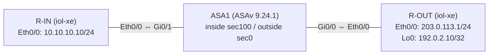

# ASAv Basic Verification Lab

Cisco Modeling Labs (CML) 2.x 上に構築した **Cisco ASAv** の基本機能検証ラボです。
インターフェース設定、Security Levelによるトラフィック制御、デフォルトルート、
ステートフル・インスペクション（TCP）、ICMP Inspectionの5項目を、実機（仮想アプライアンス）の
`show`コマンド・`packet-tracer`の実出力で検証（ASA-01〜05）した上で、CML REST APIのリンク単位
パケットキャプチャ機能を使い、NAT/PAT変換・ステートフル検査・ACL・IPフラグメンテーション/PMTUD・
TCP障害挙動を実パケットとWireshark/tshark解析で裏付ける追加検証（WS-01〜05）も行っています。

## 目次

- [検証概要](#検証概要)
- [検証目的](#検証目的)
- [使用環境](#使用環境)
- [使用イメージ](#使用イメージ)
- [トポロジー](#トポロジー)
- [IPアドレス設計](#ipアドレス設計)
- [ASAのインターフェース設計](#asaのインターフェース設計)
- [試験項目と試験方法](#試験項目と試験方法)
- [実測結果](#実測結果)
- [Wireshark検証（WS-01〜05）](#wireshark検証ws-0105)
- [トラブルシューティング](#トラブルシューティング)
- [学習できたこと](#学習できたこと)
- [ディレクトリ構成](#ディレクトリ構成)
- [再現手順](#再現手順)
- [注意事項](#注意事項)

---

## 検証概要

ASAv1台をFW/境界ルータとして、Inside側端末（R-IN）とOutside側ルータ兼サーバ（R-OUT）の間に配置し、
CML REST API経由でトポロジー構築・設定投入・起動・コンソール操作（WebSocket経由）まで一貫して自動化して検証しました。

## 検証目的

- ASAv 9.24.1の基本的なファイアウォール機能（インターフェース、Security Level、ルーティング、
  ステートフル・インスペクション、アプリケーション・インスペクション）を、実際の`show`/`packet-tracer`出力で確認する
- CML REST APIのみ（SSH不使用）でラボ構築からコンソール操作までを行う手法を確立する

## 使用環境

| 項目 | 値 |
|---|---|
| CMLバージョン | 2.10.0-13 |
| ラボ名 | `asa-basic-verification` |
| API | CML REST API v0（`/api/v0/...`）+ コンソール用WebSocket（`wss://<host>/ws/dispatch/frontend/console`） |

## 使用イメージ

| ノード | Node Definition | Image Definition | バージョン |
|---|---|---|---|
| ASA1 | `asav` | `asav-9-24-1` | ASAv 9.24.1 |
| R-IN / R-OUT | `iol-xe` | `iol-xe-17-18-02` | IOL XE 17.18.02 |

## トポロジー



## IPアドレス設計

| ノード | インターフェース | IPアドレス |
|---|---|---|
| R-IN | Ethernet0/0 | 10.10.10.10/24 |
| ASA1 | GigabitEthernet0/1（inside） | 10.10.10.1/24 |
| ASA1 | GigabitEthernet0/0（outside） | 203.0.113.2/24 |
| R-OUT | Ethernet0/0 | 203.0.113.1/24 |
| R-OUT | Loopback0 | 192.0.2.10/32 |

## ASAのインターフェース設計

| 物理インターフェース | nameif | Security Level | IPアドレス | 接続先 |
|---|---|---|---|---|
| GigabitEthernet0/1 | inside | 100 | 10.10.10.1/24 | R-IN |
| GigabitEthernet0/0 | outside | 0 | 203.0.113.2/24 | R-OUT |
| Management0/0 | （未使用） | - | - | - |

## 試験項目と試験方法

| ID | 検証項目 | 試験方法 |
|---|---|---|
| ASA-01 | インターフェース | `show interface ip brief` / `show nameif` / `show running-config interface` |
| ASA-02 | Security Level | `packet-tracer input inside icmp 10.10.10.10 8 0 203.0.113.1 detailed`（inside→outside）/ `packet-tracer input outside icmp 192.0.2.10 8 0 10.10.10.10 detailed`（outside→inside、新規） |
| ASA-03 | デフォルトルート | `show route` / `ping 203.0.113.1` / `ping 192.0.2.10` |
| ASA-04 | ステートフル・インスペクション（TCP） | R-INからTCP接続を開始し、ASA1の`show conn` / `show conn address 10.10.10.10` / `packet-tracer`（inside→outside, outside→inside双方向）で確認 |
| ASA-05 | ICMP Inspection | Inspection無効時と`inspect icmp`追加後のping成功率を比較、`show service-policy`でカウンタを確認 |

## 実測結果

全5項目 **PASS**。詳細な期待結果・実測結果・実出力へのリンクは [docs/test-status.md](docs/test-status.md) を参照してください。

サマリ:

| ID | 判定 |
|---|---|
| ASA-01 インターフェース | ✅ PASS |
| ASA-02 Security Level | ✅ PASS |
| ASA-03 デフォルトルート | ✅ PASS |
| ASA-04 ステートフル・インスペクション | ✅ PASS（後述のトラブルシューティングを経て確認） |
| ASA-05 ICMP Inspection | ✅ PASS |
| WS-01 NAT/PAT | ✅ PASS |
| WS-02 Stateful Inspection（パケットキャプチャ） | ✅ PASS |
| WS-03 ACL permit/deny | ✅ PASS |
| WS-04 MTU/フラグメンテーション/PMTUD | ✅ PASS |
| WS-05 TCP障害解析 | ✅ PASS（zero-windowのみNOT RUN、理由は下記） |

## Wireshark検証（WS-01〜05）

ASA-01〜05の`show`/`packet-tracer`出力による検証に加え、CML REST APIのリンク単位pcapキャプチャ機能
（`/api/v0/labs/{lab}/links/{link}/capture/*` + `/api/v0/pcap/{link_id}`）で実際のパケットを取得し、
Wireshark/tsharkで解析した追加検証です。ASAv/IOL-XE自体の`capture`コマンドは使用していません
（CMLオーケストレーション層でリンクを直接キャプチャする方式）。

| ID | 検証項目 | 判定 | 詳細 |
|---|---|---|---|
| WS-01 | NAT/PATアドレス・ポート変換（前後比較） | ✅ PASS | [docs/wireshark-verification.md#ws-01-natpat-アドレスポート変換](docs/wireshark-verification.md#ws-01-natpat-アドレスポート変換) |
| WS-02 | Stateful Inspection（inside起点 vs outside起点） | ✅ PASS | [docs/wireshark-verification.md#ws-02-stateful-inspectioninside起点-vs-outside起点](docs/wireshark-verification.md#ws-02-stateful-inspectioninside起点-vs-outside起点) |
| WS-03 | ACL permit/deny比較 | ✅ PASS | [docs/wireshark-verification.md#ws-03-acl-permitdeny比較](docs/wireshark-verification.md#ws-03-acl-permitdeny比較) |
| WS-04 | MTU / IPフラグメンテーション / PMTUD | ✅ PASS | [docs/wireshark-verification.md#ws-04-mtu--ipフラグメンテーション--pmtud](docs/wireshark-verification.md#ws-04-mtu--ipフラグメンテーション--pmtud) |
| WS-05 | TCP障害解析（RST/service down/retransmission/dup-ack/out-of-order/zero-window） | ✅ PASS（zero-windowのみNOT RUN） | [docs/wireshark-verification.md#ws-05-tcp障害解析](docs/wireshark-verification.md#ws-05-tcp障害解析) |

試験ごとの目的・構成図・実行コマンド・使用した表示フィルター・実測結果・考察・復旧内容の全詳細は
[docs/wireshark-verification.md](docs/wireshark-verification.md)、pass/fail一覧は[docs/test-status.md](docs/test-status.md)を参照してください。

### pcapの開き方

`wireshark/captures/`配下の`.pcap`ファイルはWiresharkでそのまま開けます。CLIで内容を確認する場合は例えば:

```
tshark -r wireshark/captures/WS-01-after-nat-outside-link.pcap
```

各試験ごとの1リンクずつの生pcapに加え、`wireshark/analysis/`配下にtsharkのフィールド抽出結果（テキスト）を
収録しています。

### 推奨表示フィルター一覧

| フィルター | 用途 |
|---|---|
| `tcp.port == 7` | tcp-small-servers Echoを使った通信の抽出（WS-01/02/05） |
| `tcp.port == 9` | tcp-small-servers Discardを使った通信の抽出（WS-03） |
| `ip.addr == 10.10.10.10 && ip.addr == 203.0.113.1` | R-IN⇔R-OUT間の通信抽出 |
| `ip.src == 203.0.113.2` | PAT変換後の送信元アドレスの抽出（WS-01） |
| `tcp.flags.reset == 1` | RSTパケットの抽出（WS-05） |
| `tcp.analysis.retransmission == 1` | TCP再送パケットの抽出（WS-05） |
| `tcp.analysis.duplicate_ack == 1` | 重複ACKの抽出（WS-05） |
| `tcp.analysis.out_of_order == 1` | 順序入れ替わりパケットの抽出（WS-05） |
| `ip.flags.mf == 1 \|\| ip.frag_offset > 0` | IPフラグメンテーションの抽出（WS-04） |
| `icmp.type == 3 && icmp.code == 4` | PMTUD（Fragmentation Needed）応答の抽出（WS-04） |

## トラブルシューティング

検証中に2つの問題に遭遇し、原因切り分けを行いました。詳細な事実関係は [docs/troubleshooting.md](docs/troubleshooting.md) を参照してください。

1. **ASA-04でのTCP/80接続拒否**: `ip http server`を使ったHTTP/80での試験が、ASAではなくR-OUT側（CMLの`iol-xe`イメージ）のコントロールプレーンTCPサービスの制約により失敗。`service tcp-small-servers`（TCP/7 Echo）に切り替えて再試験し、ASA自体のステートフル・インスペクション機能は正常に動作することを確認。
2. **ASA1コンソール異常**: 証跡の再取得中、ASA1のコンソールがDPDKライブラリのメモリマップらしき出力を継続的に返す状態を観測。原因は未特定（推測に留める）。CML API上のノード状態は`BOOTED`のまま。`reload`等の復旧操作は意図的に行っていない。これにより、ASA1の完全な`show running-config`（統合版）は未取得（[configs/ASA1.cfg](configs/ASA1.cfg)は異常発生前に取得できた断片のみ収録）。

## 学習できたこと

- **CML REST APIのみでのラボ構築**: ノード作成・インターフェース明示作成（`POST /labs/{id}/interfaces`、slot指定）・リンク作成・day0-config投入・起動・状態ポーリングまで、SSHを使わずAPIで完結できる。
- **コンソール操作の実現方法**: CML REST API v0にはコマンド実行APIが存在しないが、CML自身のフロントエンドJSを解析することで、実際に使われているコンソールWebSocketプロトコル（`wss://<host>/ws/dispatch/frontend/console?...&uuid=<console_key>` + 接続直後の`{"token": "<JWT>"}`認証メッセージ）を特定し、`websocket-client`だけで自動化できた。
- **Node Definitionの実態確認の重要性**: 「IOL-L3」という名称のNode Definitionは存在せず、実際は`iol-xe`（L3対応）と`ioll2-xe`（明示的にL2）に分かれていることをAPIから確認して初めて分かった。ドキュメントやユーザーの想定だけで進めず、`GET /api/v0/node_definitions`で実際の定義を確認する重要性を再認識した。
- **ASAのデフォルト挙動**: ASAvは初回`enable`時にパスワード未設定だと強制的に設定を求められること、`policy-map global_policy`にICMPインスペクションはデフォルトで含まれないこと（ステートレスなICMPは戻りパケットが素通りしない）など、実機に近い挙動を確認できた。
- **仮想ラボ特有の制約の切り分け**: 「動かない」ときに、ASAの設定ミスなのか、CMLのイメージ・プラットフォーム側の制約なのかを、自己接続テストなど段階的な切り分けで判別する必要があることを実例で経験した。

## ディレクトリ構成

```
.
├── README.md
├── configs/
│   ├── ASA1.cfg        # 部分キャプチャ（troubleshooting.md参照）
│   ├── R-IN.cfg
│   └── R-OUT.cfg        # secretはマスキング済み
├── outputs/
│   ├── ASA-01-interface.txt
│   ├── ASA-02-security-level.txt
│   ├── ASA-03-default-route.txt
│   ├── ASA-04-stateful-inspection.txt
│   └── ASA-05-icmp-inspection.txt
├── wireshark/
│   ├── captures/          # WS-01〜05の生pcap（リンク単位、Wiresharkでそのまま開ける）
│   └── analysis/          # tsharkによるフィールド抽出結果（テキスト）
└── docs/
    ├── test-status.md
    ├── troubleshooting.md
    └── wireshark-verification.md
```

## 再現手順

1. CML 2.10.0-13上に、`asav`（image: `asav-9-24-1`）ノード1台、`iol-xe`（image: `iol-xe-17-18-02`）ノード2台を作成する。
2. トポロジーどおりに接続する: R-IN Ethernet0/0 ⇔ ASA1 GigabitEthernet0/1（inside）、ASA1 GigabitEthernet0/0（outside）⇔ R-OUT Ethernet0/0。
3. `configs/`配下の各ファイルを参考に、day0-config（もしくは起動後の手動投入）で設定する。ASA1は`configs/ASA1.cfg`が部分キャプチャのため、`hostname ASA1`・`enable password`・`route outside 0.0.0.0 0.0.0.0 203.0.113.1 1`等を別途追加する必要がある。
4. ラボを起動し、全ノードが`BOOTED`になるのを待つ（ASAvは数分かかる場合がある）。
5. `docs/test-status.md`の各試験方法に従ってコマンドを実行し、`outputs/`の実測結果と比較する。

## 注意事項

- 本リポジトリの設定ファイルはすべて実機（CML上の仮想アプライアンス）から取得した実データです。パスワード・secretハッシュ等はすべて`<REDACTED>`にマスキングしています。
- `configs/ASA1.cfg`は完全な`show running-config`ではありません。理由は[docs/troubleshooting.md](docs/troubleshooting.md)を参照してください。
- `service tcp-small-servers`はCML側が「不要なサービスを公開する」として警告する設定であり、本番環境での使用は推奨されません。本リポジトリでは隔離された検証ラボでの一時的な切り分け・試験目的でのみ使用しています。
- IPアドレス（特に`203.0.113.0/24`・`192.0.2.0/24`）はRFC 5737で規定されたドキュメント用アドレスを使用しています。
- `wireshark/`配下のpcap/解析ファイルに含まれるIPアドレスもすべて上記のプライベート/ドキュメント用アドレス範囲内であり、外部に公開すべきでない実IPアドレスは含まれていません。
- WS-01（NAT object/rule）・WS-03（ACL）・WS-04（MTU）・WS-05（リンク断・パケットロス/リオーダー注入）で使用した一時的な設定・障害注入はすべて検証後にロールバック済みで、ASA-01〜03の主要コマンドを再実行してベースラインへの復帰を確認しています（[docs/wireshark-verification.md](docs/wireshark-verification.md)の「全体ロールバック確認」参照）。
- `wireshark/analysis/`配下のテキストファイルはtshark 4.6.8で生成しています。pcap自体を解析し直す場合は`tshark`（Wireshark付属）が必要です。
