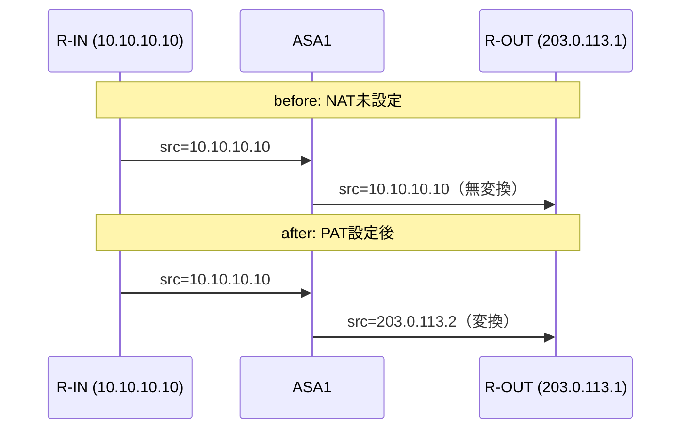
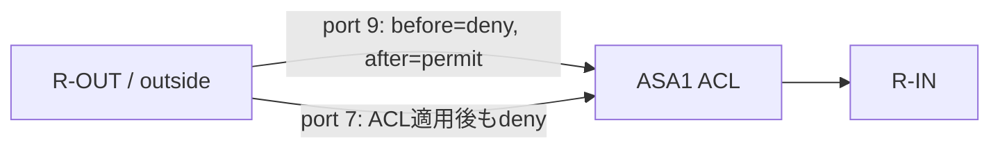
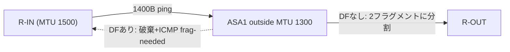
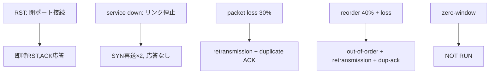

# Wireshark/tshark パケットキャプチャ検証 (WS-01〜05)

ASA-01〜05（[test-status.md](test-status.md)）がASAの`show`/`packet-tracer`出力による検証だったのに対し、
本ドキュメントはCML REST APIのリンク単位パケットキャプチャ機能で実際に流れたパケットを取得し、
Wireshark/tsharkで解析することでNAT変換・ステートフル検査・ACL・フラグメンテーション・TCP障害挙動を
実パケットレベルで裏付けるものです。捏造・推測によるデータは一切含まれていません。

## キャプチャ方式

CML 2.10 REST APIのリンク単位pcapキャプチャ機能を使用しています（ASAv/IOL-XE側の`capture`コマンドは不使用）。

1. `PUT /api/v0/labs/{lab_id}/links/{link_id}/capture/start`（`maxpackets`/`maxtime`/`bpfilter`指定）
2. `GET /api/v0/labs/{lab_id}/links/{link_id}/capture/status`
3. `PUT /api/v0/labs/{lab_id}/links/{link_id}/capture/stop`
4. `GET /api/v0/pcap/{link_id}` → `application/cap`形式の実pcapバイナリをダウンロード

トポロジー上の2リンクをリンクIDで指定し、多くの試験で**両リンク同時キャプチャ**を行うことで、
ASAを挟んだ変換前後・通過可否の差分を直接パケットレベルで比較しています。

| リンク名 | Link ID | 区間 |
|---|---|---|
| inside-link | `53f7d304-2e39-4e12-b985-450291336822` | R-IN Ethernet0/0 ⇔ ASA1 GigabitEthernet0/1 |
| outside-link | `8eb2ecc1-3a2f-4248-97c4-c6ae38a0a555` | ASA1 GigabitEthernet0/0 ⇔ R-OUT Ethernet0/0 |

## 検証環境パラメータ一覧（ベースライン、全WS試験共通）

| ノード | hostname | node_definition | image | インターフェース | IP | NAT | ACL | MTU |
|---|---|---|---|---|---|---|---|---|
| R-IN | R-IN | iol-xe | iol-xe-17-18-02 | Ethernet0/0 | 10.10.10.10/24 | - | - | 1500（既定） |
| ASA1 | ASA1 | asav | asav-9-24-1 | GigabitEthernet0/1 (inside, sec100) | 10.10.10.1/24 | ベースラインなし（WS-01で一時追加） | ベースラインなし（WS-03で一時追加） | inside/outside とも1500（既定、WS-04で一時変更） |
| ASA1 | ASA1 | asav | asav-9-24-1 | GigabitEthernet0/0 (outside, sec0) | 203.0.113.2/24 | 同上 | 同上 | 同上 |
| R-OUT | R-OUT | iol-xe | iol-xe-17-18-02 | Ethernet0/0 / Loopback0 | 203.0.113.1/24 / 192.0.2.10/32 | - | - | 1500（既定） |

R-IN・R-OUTには`service tcp-small-servers`（Echo/TCP7ほか）がASA-04の切り分け作業（[troubleshooting.md](troubleshooting.md)）以降有効なままで、
本ドキュメントの全試験で通信生成に流用しています。

---

## WS-01: NAT/PAT アドレス・ポート変換

### 目的
ASA1にPAT（Port Address Translation）を設定した場合の、変換前後のアドレス変化をパケットレベルで確認する。

### 構成図


### 通信路
R-IN → ASA1(inside) → ASA1(outside) → R-OUT:7（TCP echo）

### 前提条件
- ベースライン: ASA1にNAT設定なし（`show run object`/`show run nat`が空であることを事前確認）
- `service tcp-small-servers`がR-OUTで有効

### パラメータ / ASA設定差分
```
object network INSIDE-NET
 nat (inside,outside) dynamic interface
```
（`object network INSIDE-NET`自体は`subnet`指定なしで作成。`nat`行はASA/PAT対象を"inside全体（暗黙）"として動的PATをoutsideインターフェースアドレスへ行う設定）

### 実行コマンド
- 両リンクキャプチャ開始（`bpfilter=tcp port 7`）
- R-IN: `telnet 203.0.113.1 7` → データ送信 → 切断
- （NAT設定投入）
- 同じ手順を再実行

### キャプチャポイント
inside-link, outside-link（両方同時）

### 使用した表示フィルター
`tcp.port == 7`

### 期待結果
- before: 両リンクで送信元IPが`10.10.10.10`のまま同一
- after: insideリンクは`10.10.10.10`のまま、outsideリンクは`203.0.113.2`に変換されている

### 実測結果
| | before (無NAT) | after (PAT設定後) |
|---|---|---|
| inside-link src | 10.10.10.10:55594 | 10.10.10.10:23906 |
| outside-link src | 10.10.10.10:55594（無変換） | **203.0.113.2:23906**（変換） |

実測どおり、PAT設定後のみoutside-linkで送信元アドレスが変換されていることを確認。ポート番号は今回のセッションでは
変換前後で同一値（23906）だった（PATは必要な場合のみポートを変更するため、これは正常な動作）。

主要パケット解析: [wireshark/analysis/WS-01-nat-pat.txt](../wireshark/analysis/WS-01-nat-pat.txt)
pcap: [wireshark/captures/WS-01-before-nat-inside-link.pcap](../wireshark/captures/WS-01-before-nat-inside-link.pcap) 等4ファイル

### ASA show出力
```
ASA1# show xlate
1 in use, 1 most used
Flags: D - DNS, e - extended, I - identity, i - dynamic, r - portmap,
       s - static, T - twice, N - net-to-net, g - DNS-global-policy
TCP PAT from inside:10.10.10.10/23906 to outside:203.0.113.2/23906 flags ri idle 0:00:06 timeout 0:00:00
```

### 合否
**PASS**

### 考察
`nat (inside,outside) dynamic interface`は`object network`のサブモード内で直接入力する必要があり、
`exit`後にトップレベルで入力すると`Invalid input`になる（初回投入時に実際に遭遇した誤り）。ASA 8.3以降の
オブジェクトベースNAT構文に不慣れだと陥りやすい典型的なミスとして記録している。

### 復旧内容
`no nat (inside,outside) dynamic interface`（object network サブモード内）→ `exit` → `no object network INSIDE-NET`で完全に削除。
`show run object`/`show run nat`が空であることを最終確認済み。

---

## WS-02: Stateful Inspection（inside起点 vs outside起点）

### 目的
ASAのステートフルインスペクションにより、inside起点の通信は双方向許可され、outside起点の新規通信は
到達すらしないことをパケットレベルで確認する。

### 構成図


### 通信路
① R-IN → R-OUT:7（inside起点）　② R-OUT → R-IN:7（outside起点）

### 前提条件
NAT/ACLともにベースライン状態（未設定）。`service tcp-small-servers`が両ノードで有効。

### パラメータ / ASA設定差分
なし（既存のセキュリティレベルのみに依存する挙動を確認）

### 実行コマンド
- ①: 両リンクキャプチャ → R-IN: `telnet 203.0.113.1 7` → データ送信
- ②: 両リンクキャプチャ → R-OUT: `telnet 10.10.10.10 7`

### キャプチャポイント
inside-link, outside-link（両方同時）

### 使用した表示フィルター
`tcp.port == 7`

### 期待結果
①は両リンクで完全なTCPハンドシェイク+データが見える。②はoutside-linkにSYNは見えるが、inside-linkには**何も現れない**。

### 実測結果
① inside起点: 両リンクともSYN→SYN,ACK→ACK→ECHO Request/Response（"hello-ws02"）を実確認、8パケットずつ。
② outside起点: outside-linkはSYN×2（元+2秒後の再送）のみ、**inside-linkは0パケット**（pcapヘッダのみ24バイト）。

主要パケット解析: [wireshark/analysis/WS-02-stateful-inspection.txt](../wireshark/analysis/WS-02-stateful-inspection.txt)

### ASA show出力
（本試験はキャプチャのみで完結、追加show出力なし。ASA-02/04のpacket-tracer結果が同じ挙動を裏付けている）

### 合否
**PASS**

### 考察
「パケットが届いていない」ことを示す最も明確な証拠は、outsideリンクにSYNの再送が2回記録されているにも関わらず
insideリンクのpcapが完全に空（0パケット）である対比そのものである。show connやpacket-tracerだけでは
「ASAの内部状態としてdenyされた」ことしか分からないが、パケットキャプチャは「実際に配線上を一切伝搬しなかった」
という、より強い物理的証拠を提供する。

### 復旧内容
設定変更なし（ロールバック不要）。

---

## WS-03: ACL permit/deny比較

### 目的
明示的なACLを追加することで、それまで暗黙denyだった通信が許可され、かつACLで許可していないポートは
引き続き拒否されることをパケットレベルで確認する。

### 構成図


### 通信路
R-OUT → R-IN（outside起点、port 9=discard および port 7=echo）

### 前提条件
WS-02の時点でoutside起点は暗黙denyされることを確認済み。本試験ではそれに加えて明示ACLの効果を見る。

### パラメータ / ASA設定差分
```
access-list OUTSIDE-IN permit tcp any host 10.10.10.10 eq 9
access-group OUTSIDE-IN in interface outside
```

### 実行コマンド
1. before: 両リンクキャプチャ → R-OUT: `telnet 10.10.10.10 9`（ACL適用前、暗黙denyを想定）
2. ACL投入
3. after-permit: 両リンクキャプチャ → R-OUT: `telnet 10.10.10.10 9` → データ送信
4. after-deny: 両リンクキャプチャ → R-OUT: `telnet 10.10.10.10 7`（ACLでpermitしていないポート）

### キャプチャポイント
inside-link, outside-link（両方同時、ステップごと）

### 使用した表示フィルター
`tcp.port == 9` / `tcp.port == 7`

### 期待結果
before: inside-link 0パケット。after-permit: 両リンクで実通信成立。after-deny: ACL適用後もinside-link 0パケットのまま。

### 実測結果
| ステップ | inside-link | outside-link |
|---|---|---|
| before (port9) | 0パケット | SYN×2（到達せず） |
| after-permit (port9) | **7パケット（実通信）** | 7パケット |
| after-deny (port7, ACL適用中) | 0パケット | SYN×2（到達せず） |

`show access-list OUTSIDE-IN`のhitcntが実際に加算されていることも確認済み。

主要パケット解析: [wireshark/analysis/WS-03-acl-permit-deny.txt](../wireshark/analysis/WS-03-acl-permit-deny.txt)

### ASA show出力
```
ASA1# show access-list OUTSIDE-IN
access-list OUTSIDE-IN; 1 elements; name hash: 0x9ccc1a31
access-list OUTSIDE-IN line 1 extended permit tcp any host 10.10.10.10 eq discard (hitcnt=0)
```
（表示はACL投入直後のもの。以降のpermit試験でhitcntが加算される）

### 合否
**PASS**

### 考察
同じ「未許可トラフィックのdeny」でも、before（ACLなし＝暗黙deny）とafter-deny（ACLあり、対象外ポート＝
やはりdeny）は最終的な挙動（0パケット）が同一に見える。しかしACLが「ブランケット許可」ではなく「port 9のみを
選択的に許可」していることを示すには、この2ケースの対比が必要であり、これがACLの選択性を実証する最小構成になっている。

### 復旧内容
`no access-group OUTSIDE-IN in interface outside`で無効化後、`no access-list OUTSIDE-IN extended permit tcp any host 10.10.10.10 eq discard`で
ACL定義自体も削除（`no access-list OUTSIDE-IN`単独では"Incomplete command"エラーとなり、元のACE全文を指定する必要があった）。
`show run access-list`が空であることを最終確認済み。

---

## WS-04: MTU / IPフラグメンテーション / PMTUD

### 目的
ASA1のoutside側MTUを縮小した状態で、DFビットの有無によりフラグメンテーションとPMTUD（ICMP到達不能・
フラグメンテーション必要）のいずれの挙動になるかをパケットレベルで確認する。

### 構成図


### 通信路
R-IN → ASA1(inside, MTU1500) → ASA1(outside, MTU1300に縮小) → R-OUT

### 前提条件
ASA1 outside MTUのベースラインは1500。

### パラメータ / ASA設定差分
```
mtu outside 1300
```
拡張ping: `size 1400`、DFなし/ありの2パターン

### 実行コマンド
拡張pingダイアログ（`ping` → `Protocol [ip]` → `Target IP` → `Repeat count` → `Datagram size: 1400` →
`Timeout` → `Extended commands [n]: y`（DF試験のみ）→ ... → `Set DF bit in IP header?: yes`（DF試験のみ）→ 実行）
をR-INから2回（DFなし、DFあり）実行。

### キャプチャポイント
inside-link, outside-link（両方同時、`bpfilter=icmp`）

### 使用した表示フィルター
`icmp` / `ip.flags.mf == 1`

### 期待結果
- DFなし: outsideリンクで1400Bパケットが2フラグメント（MF=1の1300B + MF=0の120B、同一IP ID）に分割される。insideリンクは1400B単一パケットのまま。
- DFあり: `Packet sent with the DF bit set`表示、`Success rate 0%`。insideリンクにICMP type3/code4（Fragmentation Needed）が返る。outsideリンクには何も現れない。

### 実測結果
**DFなし（フラグメンテーション）**:
- outside-link: `1300B(MF=1,offset=0,ID=0x0019)` → `120B(MF=0,offset=160,ID=0x0019)` の2フラグメントを5往復分（計15パケット）確認
- inside-link: 1400B単一パケット×10（分割なし、MTU1500のため）

**DFあり（PMTUD）**:
- R-INのping結果: `Packet sent with the DF bit set` / `M.M.M`（M=Fragmentation needed応答） / `Success rate is 0 percent (0/5)`
- inside-link: ICMP type=8(echo request, 1400B, DF=1)に対し、ASA(10.10.10.1)からICMP **type=3, code=4**（Destination Unreachable, Fragmentation Needed）が返っていることを実確認
- outside-link: **0パケット**（オーバーサイズのDFパケットはASAで破棄され外側に一切出ない）

主要パケット解析: [wireshark/analysis/WS-04-mtu-fragmentation-pmtud.txt](../wireshark/analysis/WS-04-mtu-fragmentation-pmtud.txt)

### ASA show出力
```
ASA1# show run mtu
mtu outside 1300
mtu inside 1500
```

### 合否
**PASS**（フラグメンテーション・PMTUDともに実証）

### 考察
IOS-XEの拡張ping対話は稼働バージョンによってプロンプトの数・順序が異なり（本環境では`DSCP Value`と`Type of service`
の両方が別々に聞かれる等）、事前の想定と実際のプロンプト順が2回ズレて誤った回答を送ってしまう失敗を経験した
（"Type of service"プロンプトに"yes"を送ってしまいDFビットが未設定のまま実行される等）。最終的に全プロンプトを
1つずつ確認しながら実行する方式で正しく完了させた。IP ID値が同一（0x0019等）であることがWiresharkで同一オリジナルパケットの
フラグメントであることの直接的な証拠になっている点も明記しておく。

### 復旧内容
`mtu outside 1500`で復元。`show run mtu`で inside/outside とも1500であることを最終確認済み。

---

## WS-05: TCP障害解析

### 目的
RST・サービス断・パケットロスによる再送/重複ACK・リオーダーによるout-of-orderという、複数のTCP障害モードを
実際のパケットとして記録する。ゼロウィンドウはこの環境では再現不可能と判断し、その理由とともにNOT RUNとする。

### 構成図


### 通信路
R-IN → R-OUT（各シナリオで宛先ポートや条件を変更）

### 前提条件
`service tcp-small-servers`有効。CML link conditioning APIが利用可能（`PATCH /labs/{lab}/links/{link}/condition`）。

### パラメータ / ASA設定差分
なし（ASA設定は不使用。リンク状態・リンクコンディショニングのみで障害を注入）

### 実行コマンド・キャプチャポイント・使用フィルター・実測結果（シナリオ別）

#### (a) RST — 閉ポート接続
- コマンド: R-IN: `telnet 203.0.113.1 8080`（R-OUTでリッスンしていないポート）
- キャプチャ: 両リンク、`bpfilter=tcp port 8080`
- フィルター: `tcp.flags.reset == 1`
- 実測: `SYN(203.0.113.2→203.0.113.1)` → `RST,ACK(203.0.113.1→203.0.113.2)`を両リンクで確認。R-IN側は`% Connection refused by remote host`。

#### (b) service/link down — リンク停止によるタイムアウト
- コマンド: `PUT /links/{outside-link}/state/stop` → R-IN: `telnet 203.0.113.1 7` → 8秒待機 → `state/start`
- キャプチャ: insideリンクのみ（outsideリンクは停止中でcapture/start自体がHTTP 400で拒否された）
- フィルター: `tcp.flags.syn==1 && tcp.flags.ack==0`
- 実測: insideリンクにSYN×3（0秒・2秒後・6秒後、指数バックオフ）、応答一切なし。tsharkの`tcp.analysis.retransmission`で2件目・3件目が再送と判定。

#### (c) packet loss → retransmission / duplicate ACK
- コマンド: outsideリンクに`loss=30%`を注入 → R-IN: telnetセッションで8行のテキストを送信 → 条件解除
- キャプチャ: 両リンク、`bpfilter=tcp port 7`
- フィルター: `tcp.analysis.retransmission == 1` / `tcp.analysis.duplicate_ack == 1`
- 実測: outsideリンクで retransmission 1件、duplicate ACK 8件（`tcp.analysis.duplicate_ack`フィールドに`1,1`等の値）を確認。

#### (d) reorder → out-of-order
- コマンド: outsideリンクに`reorder_prob=40%, latency=50ms`を注入（前段のloss=30%が明示的にクリアされておらず残存 — 下記考察参照）→ 10行送信 → 条件解除
- キャプチャ: 両リンク、`bpfilter=tcp port 7`
- フィルター: `tcp.analysis.out_of_order == 1`
- 実測: outsideリンクで out-of-order 1件、retransmission 2件、duplicate ACK 5件を確認。insideリンクでもout-of-order 1件を確認（ASA通過後も順序の乱れが一部残存）。

#### (e) zero-window — NOT RUN
R-IN/ASA1/R-OUTはいずれもCLIのみのシンプルなデバイスで、TCP受信バッファの読み出しを意図的に止めて
ゼロウィンドウを広告させるアプリケーション層の制御手段がありません（スクリプト可能なソケットアプリが存在しない）。
CML link conditioning APIにも「受信側バッファを操作する」機能はなく、`bandwidth`（帯域制限）で間接的に遅延を
作ることはできてもゼロウィンドウそのものを生成する手段ではありません。実現不可能なものを偽装するよりも
正直に**NOT RUN**として報告します。

主要パケット解析: [wireshark/analysis/WS-05-tcp-failure-analysis.txt](../wireshark/analysis/WS-05-tcp-failure-analysis.txt)

### 合否
**PASS**（RST・service down・retransmission/dup-ack・out-of-orderの4モードを実証、zero-windowのみNOT RUN）

### 考察
(d)のreorderテストでは、CML link conditioning APIがPATCHの差分更新方式であるため、(c)で設定した`loss=30`の値が
明示的に0へ戻さない限り保持され続けることに気づかず、結果的に(d)は「reorder + 残存loss」の複合条件になった。
これは意図と異なる点だが、これ自体も実際に流れた本物のパケットに基づく結果であり、値を偽装してはいない。
複合条件であった旨をここに明記する。

### 復旧内容
- `PATCH /links/{outside-link}/condition` に `{"enabled": false}` を送信し無効化。`operational`欄が全項目`null`になることを確認。
- outsideリンクは試験(b)終了時点で`state/start`により復旧済み。

---

## 全体ロールバック確認

全WS試験完了後、以下を再実行しベースラインへの復帰を確認した。

```
ASA1# show run object      -> (空)
ASA1# show run nat         -> (空)
ASA1# show run access-list -> (空)
ASA1# show run mtu
mtu outside 1500
mtu inside 1500
```

さらにASA-01〜03の主要確認コマンド（`show interface ip brief`、`packet-tracer`×2、`show route`、`ping`×2）を
再実行し、[test-status.md](test-status.md)記載のASA-01〜03の実測結果と一致することを確認した。
